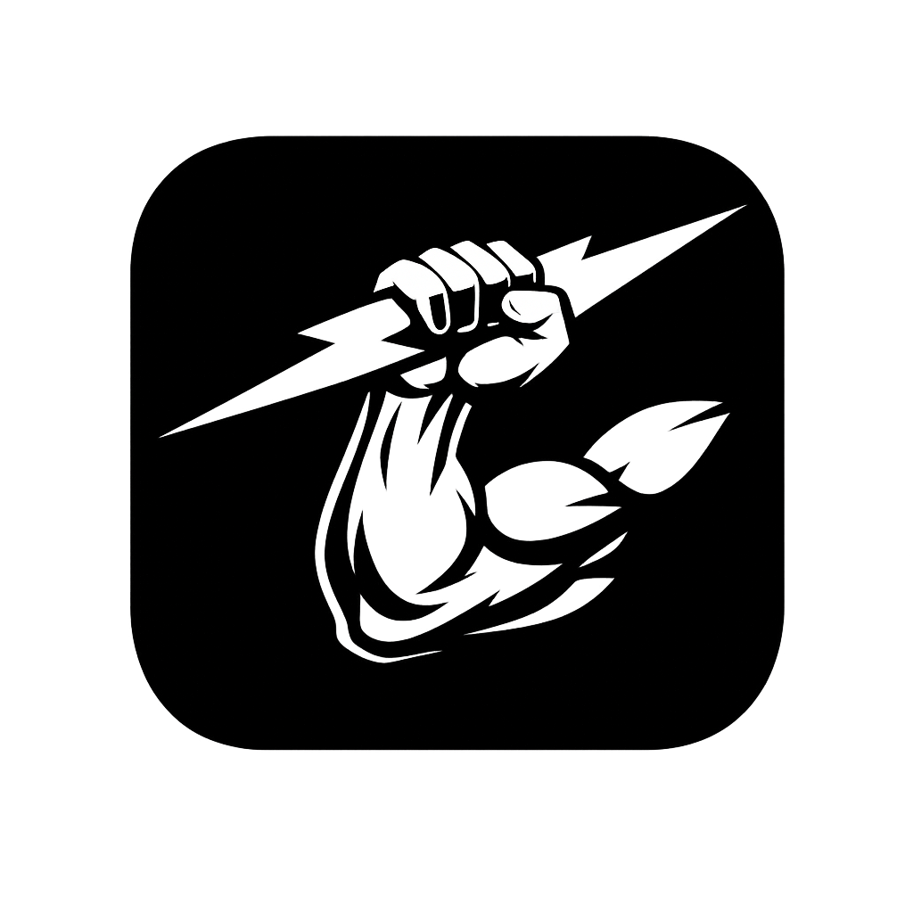

  

# Introduction

Kinetics is a fitness application built to help people track their workouts day to day. Designed offline-first with poor gym connectivity in mind, Kinetics lets you log workouts without an internet connection and automatically syncs them once connectivity is restored. Workouts sync seamlessly across multiple phones and the web app, with a future goal of making personal training accessible to everyone. The app provides intuitive analytics that help you track steady progress and flag regression so you always know where you stand.

# How it works
The application application implements the following sync engine architecture with the conflict resolution being last write wins every time user makes changes to their workouts adds or updates it it gets added to the sync queue which keeps track of the updates that need to be pushed to the server. Every interval e.g. 5min sync queue pushes changes in bulk to the server to update the changes. if it synces successfully syncs the queue is emptied and the cycle repeats itself bulk is necessary to reduce the cost of hitting the api endpoint every time changes are added that stacks up the costs

